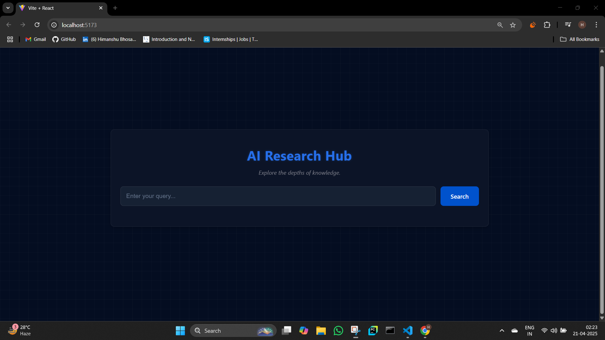
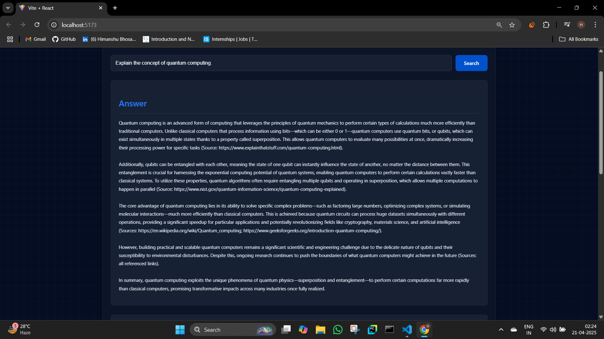
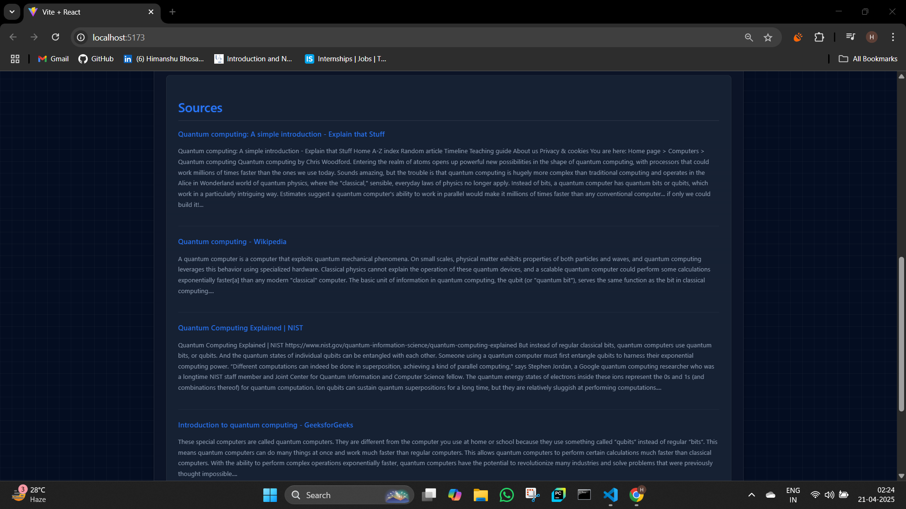

# 🔍 AI Research Hub 💡

## Overview 🚀

The AI Research Hub is a web application designed to provide insightful answers and relevant research findings based on your queries. It harnesses the power of Large Language Models (LLMs) and sophisticated information retrieval techniques to delve into complex topics and present comprehensive results.

At its core, the backend features a **Deep Research AI Agentic System** 🤖🧠 employing a dual-agent architecture orchestrated with **LangGraph** 🔗 and **LangChain** 🔗🧩 frameworks. This system is designed as follows:

* **Research & Data Collection Agent 🕵️‍♀️:** This agent focuses on actively crawling websites and gathering online information using **Tavily** 🌐🔍.
* **Answer Drafting Agent ✍️:** This agent takes the organized information collected by the research agent and synthesizes it into a comprehensive and well-structured answer 📝.

The frontend (React ⚛️) provides a user-friendly interface to interact with this powerful research system.

### Frontend Interface 🖥️

**Search page**


**Agent Answer**


**Sources used**


## Technologies Used 🛠️

* Python 🐍
* FastAPI 🚀
* LangChain 🔗🧩
* LangGraph 🔗🕸️
* Tavily 🌐🔍
* Uvicor⚙️
* React ⚛️
* CSS 💅
* JavaScript 🧩

## Setup and Installation ⚙️

### Frontend ⚛️

1.  Navigate to the `frontend` directory in your project.
2.  Install dependencies:
    ```bash
    npm install
    # or
    yarn install
    ```
3.  Start the development server:
    ```bash
    npm run dev
    # or
    yarn dev
    ```
    The frontend will typically be accessible at `http://localhost:3000` in your browser 🌐.

### Backend 🐍🔗

1.  Navigate to the `backend` directory in your project.
2.  Create a virtual environment (recommended for a clean setup 🪴):
    ```bash
    python -m venv venv
    source venv/bin/activate  # On Linux/macOS 🐧🍎
    venv\Scripts\activate  # On Windows 🪟
    ```
3.  Install dependencies:
    ```bash
    pip install -r requirements.txt
    ```
4.  Navigate to the `deep_research_agent` directory.
5.  Run the Langchain/LangGraph research agent directly :
    ```bash
    python main.py
    ```
6.  To run the FastAPI backend API server 🚀:
    ```bash
    cd ../  
    uvicorn main:app --reload
    ```
    The backend API will typically be accessible at `http://127.0.0.1:8000` 👂.

**Important Note:** Make sure your backend API keys (for LLMs 🔑, Tavily 🔑, etc.) are properly configured as environment variables or within your backend code for the AI to work its magic ✨.

## Usage 🧑‍💻

1.  Start both the frontend (⚛️) and backend (🐍🔗) development servers.
2.  Open your favorite web browser 🌐 and go to the frontend URL (usually `http://localhost:3000`).
3.  Type your burning research question 🤔 into the input field.
4.  Click the "Search" button 🖱️.
5.  The frontend will send your insightful query to the backend API 📡.
6.  The backend's **dual-agent system** 🤖🤖, powered by LangGraph 🔗🕸️ and utilizing Tavily 🌐🔍 for web crawling, will process your request. The research agent 🕵️‍♀️ will gather information, and the answer drafting agent ✍️ will synthesize the findings.
7.  The backend will send back a comprehensive drafted answer 📝 and the relevant research sources 📚 to the frontend.
8.  The frontend will proudly display the AI-powered results for your enlightenment 💡.

## License 📜

This project is licensed under the MIT License. 📝